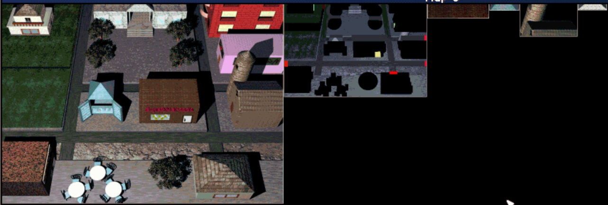
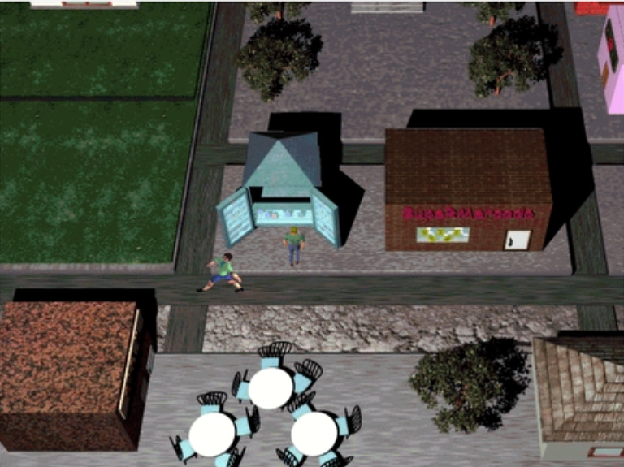
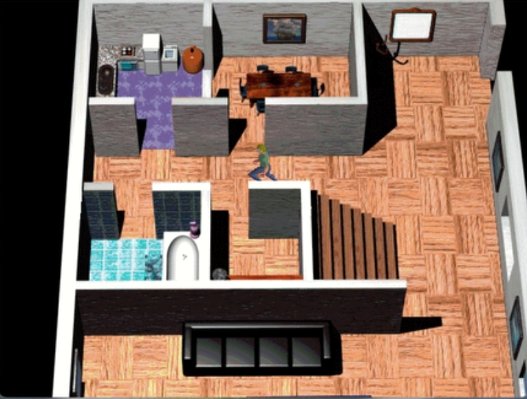
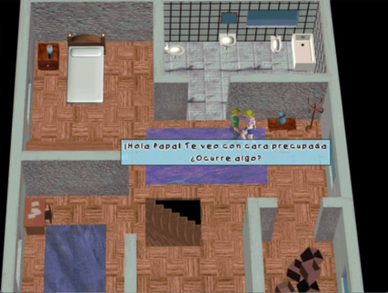
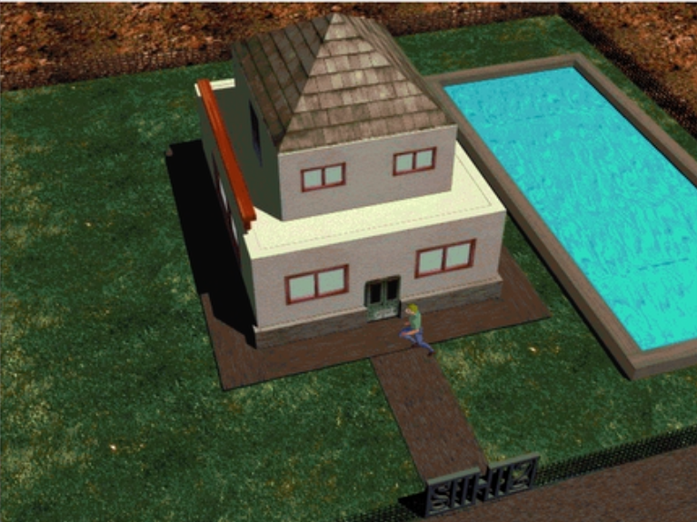
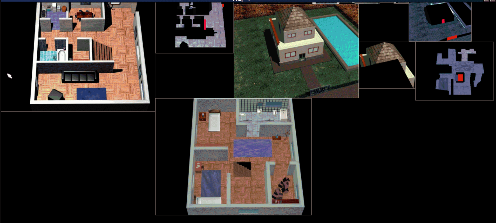
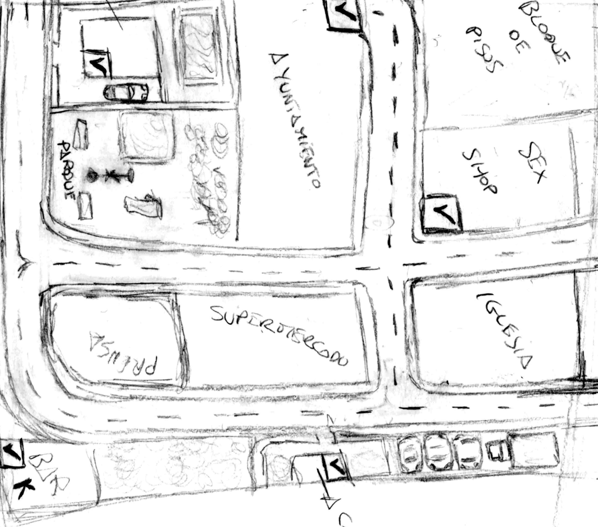
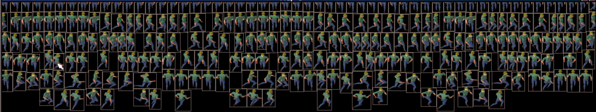
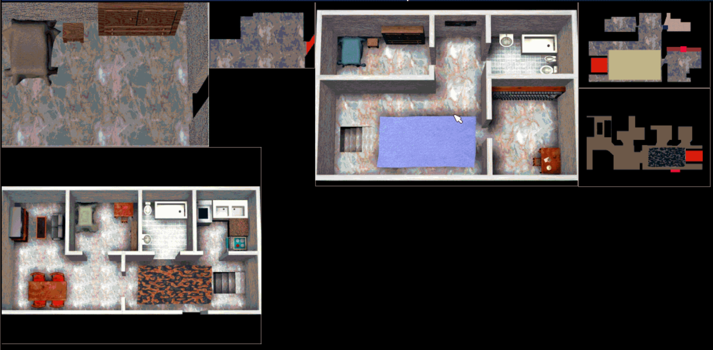

# Neo Atlantis

**An unfinished Spanish RPG from 1999, inspired by Final Fantasy VII**

*A testament to what a group of high school friends could dream up with nothing but passion, pencils, and Pentium processors.*

---

<p align="center">
  
</p>

<p align="center"><i>The village of Quorbel - pre-rendered 3D backgrounds with 2D sprites, just like Final Fantasy VII</i></p>

---

## A Visual Journey

| | | |
|:---:|:---:|:---:|
|  |  |  |
| *Quorbel Village - South zone* | *Tania's house - ground floor* | *NPC dialogues with voice acting* |

| | | |
|:---:|:---:|:---:|
|  |  |  |
| *Tania's house exterior* | *Tania's house with hardness maps* | *Configuration menu* |

Browse the [full Screenshots Gallery](screenshots/README.md) for more in-game captures.

---

## From Paper to Pixels

Every location in the game started as a hand-drawn sketch. Here's that process in action:

| Hand-drawn Sketch | Final Render |
|:---:|:---:|
|  |  |
| *Quorbel Village - South zone design* | *3D render in-game* |
|  |  |
| *Options menu design* | *Final implementation* |

The workflow was meticulous:

1. **Sketch** the location by hand, noting every detail
2. **Model** it in 3D Studio Max with painstaking accuracy
3. **Render** the background as a static image
4. **Create hardness maps** for collision detection
5. **Animate** character sprites for 8-directional movement
6. **Add** interactive objects and NPCs

---

## The Concept Art

The `concept-art/` folder contains 33 original hand-drawn sketches - the true heart of the project.

| | | |
|:---:|:---:|:---:|
|  |  |  |
| *Character: "Afrika"* | *Enemy designs* | *Police station floor plan* |

Browse the [full Concept Art Gallery](concept-art/README.md) with detailed explanations of each sketch.

---

## The Dream

In 1999, a group of friends from **IES Lope de Vega** in Spain were inspired by Final Fantasy VII to create their own RPG in that style. They were teenagers. They had no budget. They had school the next morning. They had computers that would make today's smartphones laugh.

But they had something else: **a shared vision** and the determination to make it the best they possibly could.

This repository contains everything that remains of that dream: the source code, the 3D models, the hand-drawn sketches, the voice acting recordings, and a playable demo of what could have been.

---

## The Story

The game follows **Juan**, a man plagued by prophetic dreams about an impending global catastrophe. When his wife Esther calls him one fateful day, he realizes that the time he always warned about has finally come. Together with his daughter Tania, he must find the ancient "Crystal Book" - a mysterious tome from 1728 that contains the secrets to surviving the coming days of darkness.

*From the in-game book "The Age of Aquarius":*
> A group of scientists informed us of a transcendental event in 1999: a great cosmic cross will be created due to the alignment of the planets in our Solar System... Three days of darkness will be unleashed along with all the forces of evil. During these days, humans unfit for the new civilization will perish...

The planned story was epic in scope - spanning from 1999 to 2028, involving space travel, alien encounters, and the construction of a new civilization called Neo Atlantis.

---

## Game Systems

### Character Movement

<p align="center">
  
</p>

<p align="center"><i>8-directional movement with walk and run animations for every character</i></p>

### Hardness Map Collision

<p align="center">
  
</p>

<p align="center"><i>Collision detection using colored pixels: RED for interactive elements (doors, stairs, books), BLACK for impassable areas (walls, furniture)</i></p>

---

## The Challenge

It's hard to explain to someone in 2024 what game development was like in 1999:

- **Rendering a single background** could take hours on a Pentium II
- **3D Studio Max** crashed constantly and had no undo history
- **No internet tutorials** - you learned from expensive books or figured it out yourself
- **File sharing** meant burning CDs or carrying floppy disks to school
- **Collaboration** meant phone calls and meetings at someone's house
- **No version control** - just folders named "final", "final2", "final_FINAL"

And yet, despite all this, the team produced:

- **200+ 3D models** of incredible detail
- **Full Spanish voice acting** for all dialogues
- **33 concept art sketches** planning every location
- **A complete game engine** with scrolling, collision, NPCs, and save/load
- **Multiple playable areas** with interactive objects

All of this while being full-time students, working in their spare time, and coordinating across different schedules. Only one team member had 3D Studio Max, so the others would visit his house to help, share ideas, and see the progress. Some used alternative tools like Moray + POV-Ray - where a single 1024x768 image could take an entire day to render.

---

## How to Play

The game requires **DOSBox** to run on modern systems.

1. Download and install [DOSBox](https://www.dosbox.com/)
2. Mount the `dist/` folder
3. Run `NEO.EXE`

If you encounter errors, copy `DIV32RUN.DLL` to your system folder.

### Controls

| Key | Action |
|-----|--------|
| Arrow keys | Move (8 directions) |
| Ctrl | Run |
| Enter | Interact / Advance dialogue |
| F1 | Configuration menu |
| H | Debug skip (story flags) |

---

## Project Structure

```
NeoAtlantis/
├── concept-art/       # 33 hand-drawn sketches (with gallery README)
├── 3d-models/         # 200+ 3D Studio Max source files (.max)
├── screenshots/       # Game screenshots (with gallery README)
├── src/               # Source code and game assets
│   ├── FNT/          # Font files
│   ├── FPG/          # Graphics packages (DIV format)
│   ├── PCM/          # Voice acting audio (Spanish)
│   └── PRG/          # DIV Games Studio 2 source code
├── dist/              # Compiled game (ready to play)
└── README.md
```

---

## Technical Features

- **Pre-rendered 3D backgrounds** - 3D Studio Max + POV-Ray/Moray
- **Hardness map collision** - Pixel-perfect detection using color codes
- **8-directional movement** - Walk and run animations
- **Full Spanish voice acting** - Every line of dialogue
- **Save/Load system** - Multiple save slots
- **Scrolling camera** - Smooth following of the player
- **NPC AI** - Autonomous movement patterns
- **Interactive objects** - Doors, items, triggers

---

## The Team

**Avalon Interactive (NanhySoft Team)** - 1999

| Nickname | Name | Role |
|----------|------|------|
| CrowDat | Jordi Corrales Jimenez | Lead Developer, Programming |
| Neonigma | Jose Ignacio Alvarez Ruiz (Nacho) | Programming |
| Luigi | Luis | Art/Design |

With contributions from classmates at **IES Lope de Vega**, including:
- Estrella M. Cosano Bejarano (character designs)
- Irene Golazo (character designs)
- And others who shared their ideas and enthusiasm

---

## Why It Was Never Finished

The team's ambition was both their greatest strength and their downfall.

Every single location was designed with obsessive detail. Want to add a house to the game? First, sketch the floor plan. Then model every piece of furniture - the table, the chairs, the sofa, the TV, the refrigerator, the glasses in the kitchen cabinet, the books on the shelf. Then render it. Then create the hardness map. Then test it. Then realize the lighting is wrong and do it again.

Progress was measured in months per location, not locations per month.

Eventually, school demands increased. Some went to university in different cities. Life happened. The dream was carefully packed away in a folder, surviving multiple computer changes, waiting for the day someone would find it again.

That day is today.

---

## Historical Context

Neo Atlantis is a snapshot of Spanish indie game development in the late 1990s. **DIV Games Studio** was the tool of choice for an entire generation of Spanish hobbyist developers - a programming environment that made game development accessible before Unity or Unreal existed for normal people.

This project shows what was possible when talented teenagers with no resources but plenty of determination tried to compete with the big studios. They didn't succeed in finishing their game, but they created something that, 25 years later, still tells a story worth preserving.

---

## A Message to the Team

*Nacho, Luis - if you're reading this:*

*We did something incredible. We were kids who thought we could make the next Final Fantasy, and we actually tried. We drew those sketches in class, we argued about game mechanics during lunch, we spent weekends rendering backgrounds instead of going out.*

*We didn't finish the game. But we created something real - something that exists, that works, that people can play and explore. Every line of code, every 3D model, every voice recording is proof that we weren't just dreamers.*

*Twenty-five years later, this code still runs. These models still render. This dream is still here.*

*Thank you for being part of it.*

---

## License

This project is released under the [MIT License](LICENSE).

---

<p align="center"><i>"Life is like a diamond, it has a thousand faces, each one of us must choose which one will be ours."</i></p>

<p align="center"><b>~ Neo Atlantis, 1999</b></p>
