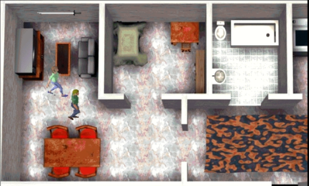
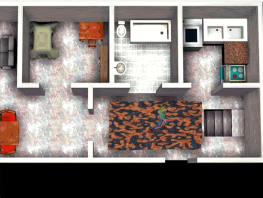
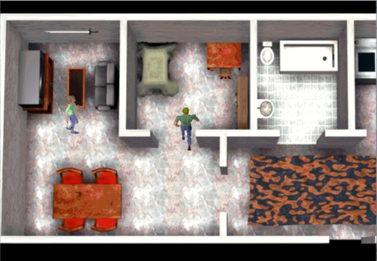

# Screenshots Gallery

**Neo Atlantis in action: a visual tour of the game**

---

## Inspired by Final Fantasy VII

These screenshots capture what the team achieved: pre-rendered 3D backgrounds with 2D character sprites, the same technique used by Square's legendary RPG. Every frame represents hours of work in 3D Studio Max, POV-Ray, and DIV Games Studio 2.

---

## The Village of Quorbel

The main explorable area of the demo - a small Spanish town rendered in painstaking detail.

### North Zone

*The northern section of Quorbel village, with the church, town hall, and various shops.*

### South Zone

*The southern section featuring the neighborhood - houses with gardens, streets, and swimming pools.*

---

## Tania's House

Tania is Juan's daughter. Her house was fully modeled inside and out.

### Exterior

*Tania's home from the outside. A two-story house with a swimming pool - every 3D element was modeled individually.*

### Ground Floor

*The ground floor interior with office, bathroom, and wooden parquet floors.*

### 3D Renders and Hardness Maps

*Composition showing 3D renders of Tania's house alongside their corresponding hardness maps used for collision detection.*

---

## Juan's House

Juan is the protagonist. His house interiors were also fully detailed.

### Upper Floor

| | |
|:---:|:---:|
|  |  |
| *Living room, bedroom, and bathroom* | *Kitchen area and stairs* |

### Juan and Esther

*Juan talking with his wife Esther. The game featured full Spanish voice acting for all dialogues.*

---

## Game Systems

### Character Sprites

*8-directional movement system with walk and run animations. Each character required dozens of individual frames.*

### Hardness Maps

*The collision detection system using colored pixels: RED for interactive elements (doors, stairs, books), BLACK for impassable areas (walls, furniture).*

---

## NPC Dialogues

*Talking with Tania, Juan's daughter. Every line of dialogue was voice-acted in Spanish.*

---

## Configuration Menu

*The options screen featuring resolution settings, sound volume control, and subtitle toggle - all designed from scratch.*

---

## Technical Achievement

What makes these screenshots remarkable isn't just what you see, but how it was made:

- **3D Studio Max** on Pentium II processors
- **Hours of rendering** for each background (sometimes a full day for a single 1024x768 image)
- **No internet** - everything learned from books
- **Collaboration** via floppy disks and phone calls
- **Passion** that kept friends working nights and weekends

---

## Complete Screenshot List

| File | Description |
|------|-------------|
| Screenshot_184058.png | Title screen / menu |
| Screenshot_185043.png | Game scene |
| Screenshot_185059.png | Game scene |
| Screenshot_185349.png | Character sprite animation |
| Screenshot_185537.png | Hardness map visualization |
| Screenshot_185628.png | Tania's house - renders and hardness maps |
| Screenshot_185705.png | Quorbel village - north zone |
| Screenshot_185730.png | Game scene |
| Screenshot_185759.png | Game scene |
| Screenshot_194116.png | Juan's house - upper floor |
| Screenshot_194201.png | Juan's house - kitchen area |
| Screenshot_194325.png | Options menu |
| Screenshot_194405.png | Juan and Esther (his wife) |
| Screenshot_194452.png | Quorbel village - south zone |
| Screenshot_194533.png | Tania's house - exterior |
| Screenshot_194604.png | Tania's house - ground floor |
| Screenshot_194622.png | Dialogue with Tania (Juan's daughter) |

---

*"Every pixel tells a story of dedication."*
